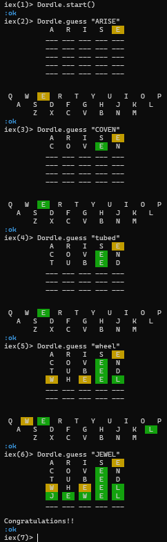
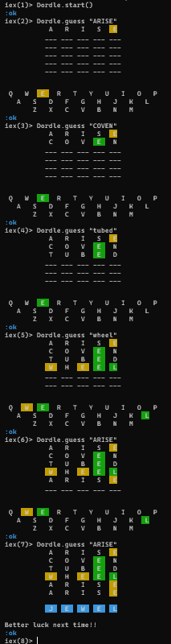
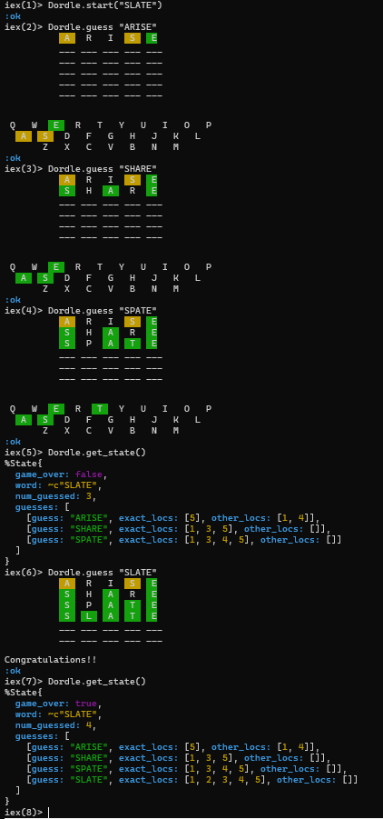

# Dordle

## Wordle implementation in Elixir

Implementation of the word game [Wordle](https://en.wikipedia.org/wiki/Wordle).
Six guesses to find the target 5-letter word. After each guess the guesses so
far are output, each letter color-coded green if it's in the word and in the
correct spot; yellow if it's in the word but in the wrong spot; and no color
if it's not in the word at all.

### Usage

Starting the system, and making guesses until the word is found on the fifth
of six guesses. The output is omitted in the iex output here, but is seen in
the screenshot below. Note that guesses are case-insensitive. ([JEWEL was the
word on April 1, 2025 (no fooling!)](https://www.rockpapershotgun.com/wordle-hint-and-answer-today-01-04-25)).
```
iex(1)> Dordle.start()
iex(2)> Dordle.guess "ARISE"
iex(3)> Dordle.guess "COVEN"
iex(4)> Dordle.guess "tubed"
iex(5)> Dordle.guess "wheel"
iex(6)> Dordle.guess "JEWEL"
```



This time failing to find the word after all six guesses (apparently the user
couldn't give up on ARISE!).
```
iex(1)> Dordle.start()
iex(2)> Dordle.guess "ARISE"
iex(3)> Dordle.guess "COVEN"
iex(4)> Dordle.guess "tubed"
iex(5)> Dordle.guess "wheel"
iex(6)> Dordle.guess "ARISE"
iex(7)> Dordle.guess "ARISE"
```



It is also possible to provide your own starting word, perhaps with another
person to do the guessing (and for my own testing). We see here how we can
observe the internal state of the system as well.
```
iex(1)> Dordle.start("SLATE")
iex(2)> Dordle.guess "ARISE"
iex(3)> Dordle.guess "SHARE"
iex(4)> Dordle.guess "SPATE"
iex(5)> Dordle.get_state()
iex(6)> Dordle.guess "SLATE"
iex(7)> Dordle.get_state()
```




